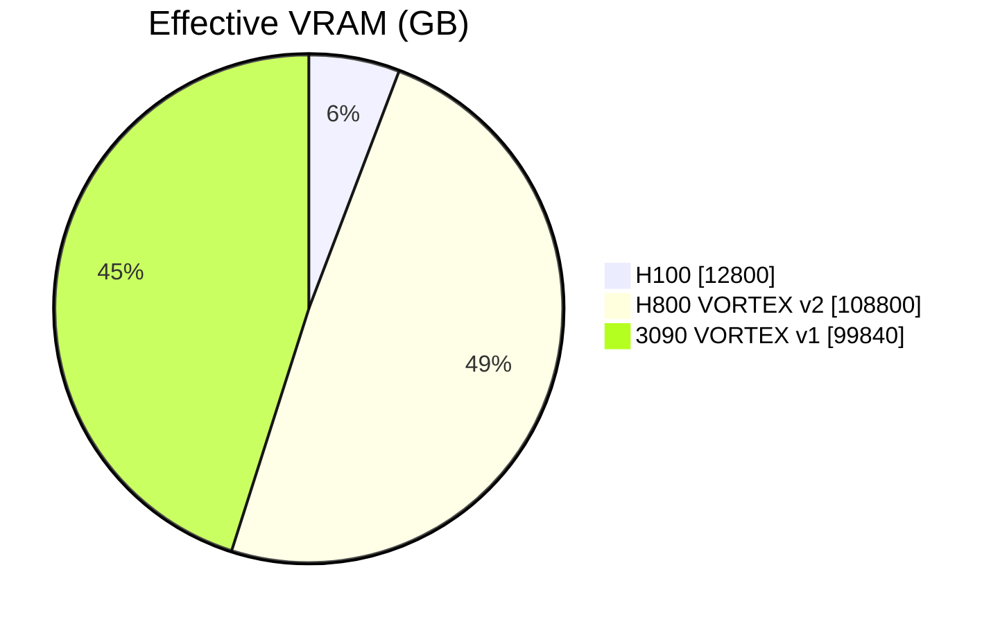
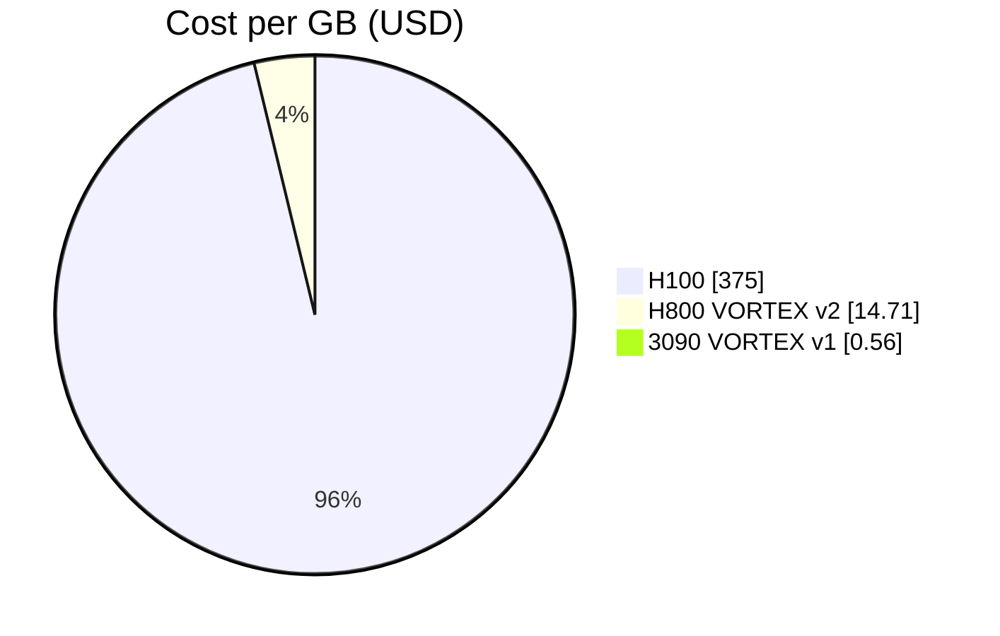

# Comparison: Equal-Chip Baseline (160 Chips)

## Framing
This is a strategic comparison snapshot for architecture discussion.
All values below are project-side estimates/claims for early prior-art publication,
not audited benchmarks.

## Table (160 chips each)

| Metric | H100 SXM (NVIDIA) | H800 SXM (VORTEX v2 concept) | RTX 3090 (VORTEX v1 concept) |
|---|---:|---:|---:|
| FP16 TFLOPS | 158,304 | 158,304 | 5,696 |
| FP8 TFLOPS | 316,624 | 316,624 | N/A |
| Native VRAM (GB) | 12,800 | 12,800 | 3,840 |
| Effective VRAM (GB) | 12,800 | 108,800 | 99,840 |
| Power (kW) | 112 | 112 | 56 |
| Chip Cost (USD) | $4,800,000 | $1,600,000 | $56,000 |
| Cost per GB (USD/GB) | $375.00 | $14.71 | $0.56 |
| GB per $1000 | 2.67 | 68.0 | 1,782 |

## Visual 1: Effective VRAM (GB)

## Visual 2: Cost per GB (USD)

## Claimed takeaways
- VORTEX v2 (H800 concept): same stated compute class as H100 baseline, with much larger effective memory and lower memory cost.
- VORTEX v1 (3090 concept): far lower compute class, but extreme memory-cost accessibility for inference-focused paths.

## Caveat
Any fair production comparison requires controlled end-to-end benchmarks:
- throughput under identical model/server settings,
- tail latency under real request mixes,
- total cost of ownership (hardware + energy + ops).
